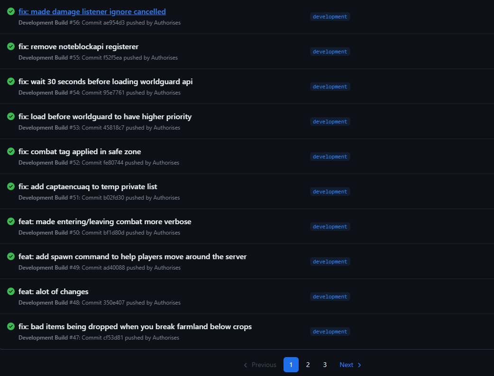

# This is a collection of my notable, previously private, Minecraft repositories.
### Most of these repositories were created and maintained over a year ago, and my skills in Java have significantly developed since then.

### CaveletCore is the largest project, with over 15 folders of code. Cavelet was a large project I developed solo, with the aim of creating a server that feels like a combination of competitive factions and Hypixel Skyblock. The plugin features its own factions system which also includes value calculation based on items in containers in the faction's core chunk, a full custom item system which allows custom enchantments to displayed in a custom way (horizontally), hundreds of custom items with different uses, a skills system offering rewards and bonuses for higher levels, a fully custom time based shop where items have limited stock, a event system with different events with different rarities able to spawn in at random locations, a chat channels system where you can toggle visibility for chats and select which one you are typing in, a reward collection system where rare items you obtain are kept so you can redeem them when neccesary (/claim) among many other smaller features built into the system.

### Screenshots of CaveletCore

.jpg)
.jpg)
.png)
.png)
.png)
.png)
.png)
.png)
.png)
.png)

### Another part of CaveletCore I can't easily publish here but I will show screenshots of, is the CI/CD system I setup for it, which included automatically updating the docker container and restarting it when a new build was available on the production branch. Here are some screenshots of inside the CI/CD system used.

### The plugin would be built on self hosted runners, then a docker image of the server would be built using the latest plugin, which would be uploaded to the self hosted private docker registry which would then trigger a re-deployment of the current server, which, using the watchtower system on docker would give a 60 second warning to players and then kick them before the server shuts down, saving player data, using a built-in script in the docker container.

### CentralC is the backend I used to connect servers automatically when I was creating my parkour network. CentralC not only acts as a central source of truth for player data, but it also manages friend requests, leaderboard calculation, and connecting to random servers of a specific type. It allows you to easily connect 5 or 50 servers to the Minecraft network, which will then be managed and have players sent to them by CentralC. CentralC was written in Java and makes use of the Spring framework and a websockets library to facilitate connections. It uses MongoDB to store player data.

### FactionsPlugin was an old plugin I wrote many years ago for a small 1.8.9 factions server. It contains a custom shop system, a custom settings system where it is easy for the developer to add new settings the player can change, a custom dynamic scoreboard with many different views, and a custom factions chunk system where players can assign the use of a chunk, e.g., a cactus chunk, a raid chunk, or a spawner chunk, which not only optimizes the way the server can work but allows for great custom features like the cactus autosell and the autokill of squids in any spawner chunk. It also contained a custom RNG system where the developer can easily add custom RNG prizes with varying rarities and where custom code can be run when won. It also contained a custom mask system where the developer can make custom masks and then the user gets special abilities when masks are worn, e.g., holding or wearing a horse mask will give you the speed effect. It had a basic kit system where users could claim a kit of their choice once per map. Additionally, a custom combat log system was made to avoid players logging out in order to not lose a PVP fight. There was also a chat gui similar to the CaveletCore chat gui but less dynamic, as my coding ability when I made this plugin was not as good as when I created the CaveletCore plugin.

### Videos of the FactionsPlugin

[Faction Chunk System 1](https://youtu.be/ZyScfEynamM) \
[Faction Chunk System 2](https://youtu.be/chSFo0rfDtU) \
[The Shop](https://youtu.be/W4hbzR20Blc) \
[Auto Squid](https://youtu.be/7ia8TMhIzwI) \
[Cactus System](https://youtu.be/Gfi1lA6LicQ)

### InstinctiaCore is a proxy-side bungeecord plugin used in conjunction with VortechCore and CentralC and is the primary communication method between the player and CentralC, so when CentralC wants to send a message to a player, it finds what proxy the player is connected to and tells the proxy to send a message to the player. The proxy also facilitates most staff commands, including the /punishment command, which is used to manage bans, mutes, and warns. The proxy also has a built-in whitelist, which should be disabled right now.

### LightweightParkour is a Minestom server (no bukkit or spigot), which is extremely lightweight (<100 MB RAM) and facilitates players on the parkour network I was creating. It allows players to create maps, play other people's maps, and each map has a leaderboard. You can change lots of settings on your map and set waypoints. The plugin currently uses MinIO (S3) to store maps, and a lot of the settings used to communicate with MinIO and CentralC have been set to "" prior to distribution here. LightweightParkour basically has its own version of VortechCore implemented inside so that it can communicate with CentralC without a plugin, as plugins don't really exist in Minecraft, and even if they did, the VortechCore plugin wouldn't be compatible as it is for Bukkit.

### VortechCore is basically just a lobby plugin for the parkour network I made, but it can also be used with normal servers, and the server type can be changed so it doesn't act as a lobby. It has a simple play GUI that fetches stats from the CentralC API to know how many players are connected and if it is joinable (if any servers of that type are currently online).

### Thanks, and if you have any questions about any of these projects just let me know. You are free to use these projects in personal, no profit projects but you must contact me before using any of this code in a profitable project.
